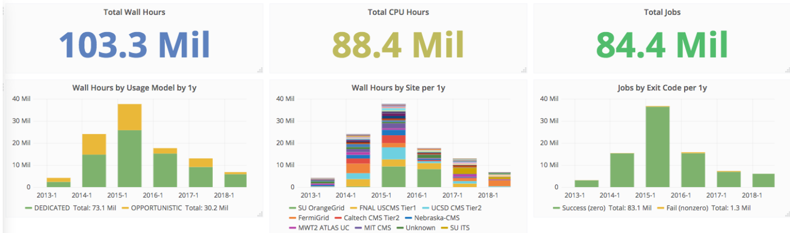
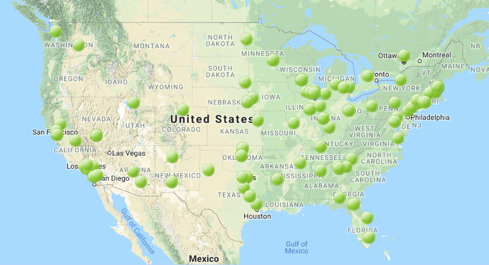
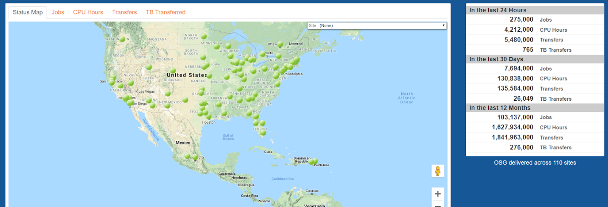
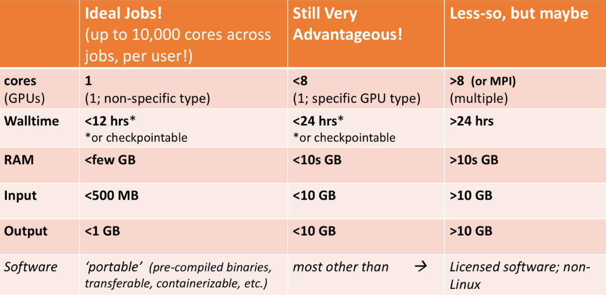

class: center, middle

  

  

# International Computational Infrastructure
## High Throughput Computing
### <a href="mailto:raphaelmcobe@gmail.com">@raphaelmcobe</a>
### Advanced Institute for Artificial Intelligence - <a href="https://advancedinstitute.ai" taget="_blank">AI2</a>
### Sao Paulo Research and Analysis Center - <a href="https://sprace.org.br" target="_blank">SPRACE</a>
### Sao Paulo State University
### January, 2020

---
class: left, middle

# Special thanks

* The organizers for the invitation;
* Rob Quick and the OSG team for most of the material used in this presentation;

---
class: left, middle

# Large Scale Scientific Computation

* Structural Protein-Ligand Interactome - SPLINTER
* Used autodock-vina (open-source program for drug discovery, molecular docking and virtual screening);
* First run in 2013 
  * docked ~3900 Proteins with 5000 Ligands for a total of ~19M docked pairs. 
 
 
.larger[.larger[### To date more than .red[**6.3B**] dockings completed;]]

---
class: left, top

# Large Scale Scientific Computation

.center[]

--
* Amazon EC2 Computing $0.046/hour
--
* .red[$4.066M] Compute Only 
--
* **Data Transfer and Storage Not Included**

???

# Some thoughts on the exercises

* It’s okay to move ahead on exercises if you have time
* It’s okay to take longer on them if you need to
* If you move along quickly, try the "On Your Own" sections and "Challenges"

# Some important rules to follow:

* Please ask questions!
  * At any time!
    * During presentation!
    * During breaks!
    * After the presentation!
    * Send messages!
    

---
class: left, middle

# The goals for this lecture

* Define 
  * .red[Local], .red[Clustered], .red[High Throughput Computing (HTC)], .red[High Performance Computing (HPC)], .red[Cloud Computing (XaaS)], and .red[Containers]
* Understand the meaning of the questions:
  * Shared infrastructure?, Exclusively allocated?, and Purchased.
* What is a Resource Manager? And why are we learning it?
  * Using HTCondor;

---
class: left, top

# The scientific scenario
--
## We all have been there...

--
* Your science computing is .red[complex]!
* Monte carlo simulations, image analysis, genetic algorithms, machine learning, etc...

.larger[It will .red[take a year (CPU time)] to get the results on your laptop.]
--

.larger[.larger[...but your paper is .red[due in a week!]]]

--
.middle[.blue[.center[.larger[.larger[What can you do?]]]]]

---
class: left, top

# The scientific scenario
## Option 1: Wait a year.
--

.center[]

---
class: left, middle

# The scientific scenario
## Option 2: Local Clustered Computing.

* Easy access to additional nodes
* .red[Local support] for porting to environment (maybe);
* Often a .red[single type of resource];
* Often .red[running at capacity];

---
class: left, top, smaller

# The scientific scenario
## Option 3: Use a “supercomputer” aka High Performance Computing(HPC)

.center[“Clearly, .red[I need the best, fastest computer] to help me out”]
--

.larger[.blue[Maybe you do, but...]]
--
* Do you have a .red[highly parallel program]?
  * i.e. individual modules must communicate
* Do you require the fastest network/disk/memory?
--

More importantly, .blue[are you willing to]:

* .red[Port your code] to a special environment?
* Request and .red[wait for an allocation]?

---
class: left, top

# The scientific scenario
## Option 4: Use lots of commodity computers

* Instead of the fastest computer, .red[lots of individual computers];
* May not be fastest network/disk/memory, but you can access .red[a lot of them];
* Job can be broken down into separate, independent pieces; 
* If I give you .red[more computers], you run .red[more jobs];
* You care more about .red[total quantity of results than instantaneous speed of computation]
--

.center[.larger[.larger[.blue[This is **high-throughput computing (HTC)**]]]]

---
class: left, middle

# The scientific scenario
## Option 5: Buy (or Borrow) some computing from a Cloud Provider

* Unlimited resources (.red[if you can afford them]);
* Full administrative access to OS of the resources you ‘buy’;
* Specialized VM images reducing effort in porting;
* XaaS Business Model;

???

* The everything as a service business model;

---
class: left, top

# The scientific scenario
## These are All Valid Options

.center[.larger[Remember the problem you have: .blue[**one month to publish results for your conference**]]]
--
* **Option 1**: You will .red[miss your deadline]
--
* **Option 2**: You .red[might miss your deadline] – if you're lucky you’ll make it (.red[or if you know the admin])
--
* **Option 3**: If you have parallelized code and can get an allocation you .blue[have a good chance]
--
* **Option 4**: If you can serialize your workflow .blue[you have a good chance]
--
* **Option 5**: You can .red[meet your deadline for a price]. 

???

## Academic clouds are becoming more available. 

---
class: left, middle

# Computing Infrastructures

* **Local Laptop/Desktop** - .red[Short jobs] with .red[small data];
* **Local Cluster** - Larger jobs and larger data but .red[subject to availability];
* **HPC** - Prime performance with .red[parallelized and optimized code];
* **HTC** - .red[Sustained computing over a long period] for serialized;
* **Cloud** - Need deeper understand the OS and have .red[deeper pockets];

---
class: left, top

# Why focus on high-throughput computing? (HTC)

* An approach to distributed computing that focuses on .blue[long-term throughput], .red[not instantaneous computing power]
  * We don’t care about .red[operations per second];
  * We care about .blue[**operations per year**];
* Implications:
  * Focus on reliability;
  * Use all available resources;
  * Any Linux based machine can participate;
--

.blue[.center[**HTC is about many jobs, many users, many servers, many sites and many workflows!**]]

---
class: left, middle

# The classical cake example

.center[.larger[.larger[How to bake a very large cake?]]]

---
class: center, bottom, inverse

background-image: url(images/largecake.jpg)
background-size: cover

# Is it necessary to build a very large oven?

---
class: left, middle
# Is it necessary to build a very large oven?
* A special oven: 
  * Expensive to build & maintain
  * Scheduling use 

--
.larger[.center[.blue[HPC is the large oven!]]]

---
class: left, middle

# Can the job be split into smaller tasks?

* Use a commodity technology;
* Conventional ovens easier to maintain;

.center[.larger[High throughput: Many ovens working independently, outputs assembled afterwards]]

.center[]

---
class: left, middle

# An example problem: BLAST

## A scientist has:
* Question: Does a protein sequence occur in other organisms?
* Data: lots of protein sequences from various organisms
* Parameters: how to search the database.

## More throughput means
* More protein sequences queried
* Larger/more protein data bases examined
* More parameter variation

???

Basic Local Alignment Search Tool
BLAST finds regions of **similarity between biological sequences**. The program compares nucleotide or protein sequences to sequence databases and calculates the statistical significance.

---
class: left, middle

# Why is HTC hard?

## The HTC system has to keep track of:
* Individual tasks  (a.k.a. jobs) & their inputs
* Computers that are available 

## The system has to recover from failures
* There will be failures! Distributed computers means more chances for failures.

---
class: left, middle

# Why is HTC hard?

## You have to share computers
* Sharing can be within an organization, or between orgs
* So you have to worry about security
* And you have to worry about policies on how you share

## If you use a lot of computers, you have to handle variety:
* Different kinds of computers (OS, speed, etc..)
* Different kinds of storage (size, speed, etc…)
* Different networks interacting (network problems are hard to debug!)

---
class: left, top

# Let’s take one step at a time

## Steps: 
--
* Can you run one job .red[on one computer]?
--
* Can you run one job .red[on another computer]?
--
* Can you run 10 jobs .red[on a set of computers]?
--
* Can you run a .red[multiple job workflow]?
--
* .red[**How do we put this all together**]?

.center[.larger[.blue[This is the path we’ll take]]]

---
class:left, middle

# Discussion

## For 5 minutes, talk to a neighbor: if you want to run one job in a local environment:

* What do you (.red[the user]) .red[need to provide] so a single job can be run?
* What does .red[the system need to provide] so your single job can be run? 
  * Think of this as a set of processes: .red[**what needs happen when the job is given**]? 
  * A “process” could be a computer process, or just an abstract task.
  
---
class: left, middle

# What does the user provide?
* A “headless job”
  * Not interactive/no GUI: how could you interact with 1000 simultaneous jobs?
* A set of input files
* A set of output files
* A set of parameters (command-line arguments)

---
class: left, middle

# What does the user provide?
* Requirements:
  * Ex: My job requires at least 2GB of RAM
  * Ex: My job requires Linux
* Control/Policy:
  * Ex: Send me email when the job is done
  * Ex: Job 2 is more important than Job 1
  * Ex: Kill my job if it runs for more than 6 hours
  
---
class: left, middle

# What does the system provide? 

* Methods to:
  * Submit/Cancel job
  * Check on state of job
  * Check on state of available computers
  
---
class: left, middle

# What does the system provide? 
* Processes to:
  * Reliably track set of submitted jobs
  * Reliably track set of available computers
  * Decide which job runs on which computer
  * Manage a single computer
  * Start up a single job
  
---
class: center, middle, inverse

# Open Science Grid

---
class: center, middle

# At the Big Bang Theory

<iframe width="560" height="315" src="https://www.youtube.com/embed/Y7tHsaPFDUc?controls=1&amp;start=2" frameborder="0" allow="accelerometer; autoplay; encrypted-media; gyroscope; picture-in-picture" allowfullscreen></iframe>

---
class: left, middle

# What is the Open Science Grid?

.large[.center[The Open Science Grid is a distributed computing network of universities and national labs, with users and computers across the United States]]

.center[]

---
class: center, middle

# OSG Size and Scale

## Last 12 months: .red[**110 sites**] - .red[**103M**] jobs - .red[**1.6B**] compute hours

---
class: center, middle

# What can it do?

.larger[.blue[.center[The Open Science Grid is built to handle **large workloads** of many (hundreds, thousands) of independent, ** "desktop-sized” calculations**.]]]

---
class: center, middle

# What workloads are good for OSG?

