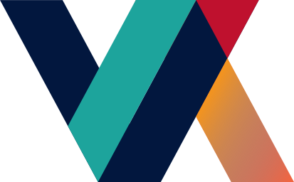

class: center, middle

<div style="float:left; text-align:left; margin-left:8%">
  
</div>
<div>
  
</div>

# International Computational Infrastructure
## Scientific Workflows
### <a href="mailto:raphaelmcobe@gmail.com">@raphaelmcobe</a>
### Advanced Institute for Artificial Intelligence - <a href="https://advancedinstitute.ai" taget="_blank">AI2</a>
### Sao Paulo Research and Analysis Center - <a href="https://sprace.org.br" target="_blank">SPRACE</a>
### Sao Paulo State University
### January, 2020

---
class: left, middle

# Special thanks

* The organizers for the invitation;
* Rob Quick and the OSG team for most of the material used in this presentation;

---
class: left, middle

# Workflows

.center[]

---
class: left, middle

# Workflow

## Definition: 

* **Definition 1**: 
  * A set of steps to complete a complex task

* **Definition 2**:
  * A graph of jobs to run: some jobs need to run before others while other jobs can run in parallel
  
  
---
class: left, middle

# Workflow

## The LIGO example: 

.center[]

---
class: left, middle

# DAGMan

* DAGMan:
  * Directed Acyclic Graph (DAG)
  * Manager (Man)
* Allows you to specify the dependencies between your jobs: 
* Manages the jobs and their dependencies
  * That is, it manages a workflow of jobs;


---
class: left, middle

# .red[D]irected .red[A]cyclic .red[G]raph (DAG)

* A DAG is the structure used by DAGMan to represent these dependencies.
* Each job is a node in the DAG.
* Each node can have any number of “parent” or “children” nodes – as long as .red[**there are no loops!**]

.pull-left[]
.pull-right[]

---
class: left, middle

# Defining a DAG

## A DAG is defined by a `.dag` file, listing each of its nodes and their dependencies:

.pull-left[
```
Job A a.sub
Job B b.sub
Job C c.sub
Job D d.sub

Parent A Child B C
Parent B C Child D
```
]

.pull-right[

]

* This DAG has five files: `a.sub`, `b.sub`, `c.sub`, `d.sub` and the `.dag` file;

---
class: left, middle

# Running DAGs:

* To start your DAG, just run condor_submit_dag with your .dag file, and Condor will start a DAGMan process to manage your jobs:
```
$ condor_submit_dag diamond.dag
```
* `condor_submit_dag` submits a job with .red[DAGMan as the executable];
* Thus the .red[DAGMan daemon itself runs as a Condor job], so you don’t have to baby-sit it;

---
class: left, middle

# Running a DAG (1)

* DAGMan acts as a scheduler, managing the submission of your jobs to Condor based on the DAG dependencies

.center[]


---
class: left, middle

# Running a DAG (2)

* DAGMan submits jobs to Condor at the appropriate times
* For example, after A finishes, it submits B & C

.center[]

---
class: left, middle

# Running a DAG (3)

* A job fails if it exits with a non-zero exit code
* In case of a job failure, DAGMan runs other jobs until it can no longer make progress, and then creates a “rescue” file with the current state of the DAG

.center[]

---
class: left, middle

# Running a DAG (4)

* Once the failed job is ready to be re-run, the rescue file can be used to restore the prior state of the DAG
  * Another example of reliability for HTC!

.center[]

---
class: left, middle

# Running a DAG (5)

* Once that job completes, DAGMan will continue the DAG as if the failure never happened

.center[]

---
class: left, middle

# Running a DAG (6)

* Once the DAG is complete, the DAGMan job itself is finished, and exits

.center[]

---
class: left, middle

# DAGMan Features

* DAGMan doesn’t have a lot of “fancy features”
  * No loops
  * Not much assistance in writing very large DAGs (script it yourself)
* Focus is on solid core
  * Add the features people need in order to run large DAGs well
  * People build systems on top of DAGMan

---
class: left, middle

# DAGMan: Reliability

* For each job, Condor generates a log file
* DAGMan reads this log to see what has happened
* If DAGMan dies (crash, power failure, etc…)
  * Condor will restart DAGMan
  * DAGMan re-reads log file
  * DAGMan knows everything it needs to know
  * Principle: DAGMan can recover state from files and without relying on a service (Condor queue, database…)
* Recall: HTC requires reliability!

---
class: left, middle

# Advanced DAGMan Tricks

* Throttles 
* DAGs without dependencies
* Sub-DAGs
* Pre and Post scripts: editing your DAG

---
class: left, middle

# Throttles

* Failed nodes can be automatically retried a configurable number of times
  * Helps recover from jobs that crash some percentage of the time
* Throttles to control job submissions
  * Max jobs submitted
  * Max scripts running
  * These are important when working with large DAGs
  
---
class: left, middle

# DAGs without dependencies

* Submit DAG with:
  * 200,000 nodes
  * No dependencies
* Use DAGMan to throttle the job submissions:
  * Condor is scalable, but it will have problems if you submit 200,000 jobs simultaneously
  * DAGMan can help you with scalability even if you don’t have dependencies
  
---
class: left, middle

# Sub-DAG

* Idea: any given DAG node can be another DAG
  * SUBDAG External Name DAG-file
* DAG node will not complete until sub-dag finishes
* Interesting idea: A previous node could generate this DAG node
* Why?
  * Simpler DAG structure
  * Implement a fixed-length loop
  * Modify behavior on the fly

---
class: left, middle

# Sub-DAG

.center[]

---
class: left, middle

# DAGMan scripts

* DAGMan allows pre & post scripts
  * Run before (pre) or after (post) job
  * Run on the same computer you submitted from
  * Don’t have to be scripts: any executable
  * Syntax:
```
JOB A a.sub
SCRIPT PRE A before-script $JOB
SCRIPT POST A after-script $JOB $RETURN
```

---
class: left, middle

# DAGMan scripts

* Pre script can make decisions
  * Where should my job run? (Particularly useful to make job run in same place as last job.)
  * What should my job do?
  * Generate Sub-DAG
* Post script can change return value
  * DAGMan decides job failed in non-zero return value
  * Post-script can look at {error code, output files, etc} and return zero or non-zero based on deeper knowledge.