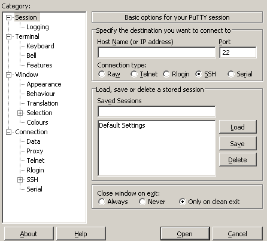
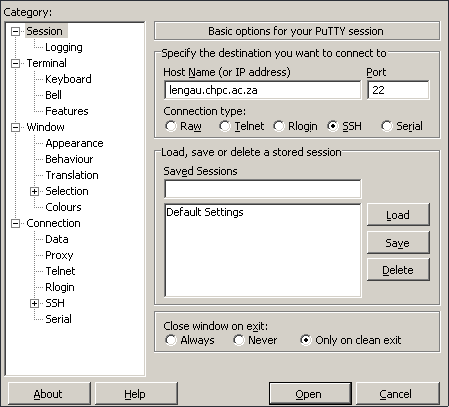
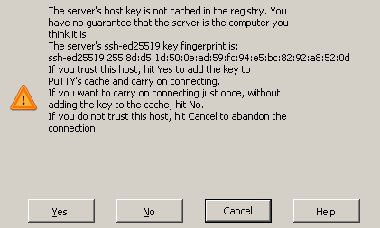

# How to Access OSG? 

## Install an SSH-Cleint

### PuTTY
Download and install a SSH Client. We recommend PuTTY, but any ssh client is acceptable. 

https://www.putty.org/ 

[Direct link to executable](https://the.earth.li/~sgtatham/putty/latest/w64/putty.exe)

After opening the executable you should see the following screen:


### Git Bash 

You can also use Git bash for accessing the infrastructure.
You can download it from [here](https://git-scm.com/downloads).

## Authentication for CI Exercises

You will receive login credentials at the beginning of this session. To authenticate (prove you who you say you are and establish what you are authorized to do) the bridgekeeper (login nodes) requires three bits of information: 

From Monty Python and the Holy Grail: 

BRIDGEKEEPER: Hee hee heh. Stop! What... is your name?\
ARTHUR: It is 'Arthur', King of the Britons.\
BRIDGEKEEPER: What... is your quest?\
ARTHUR: To seek the Holy Grail.\
BRIDGEKEEPER: What... is the air-speed velocity of an unladen swallow?\
ARTHUR: What do you mean? An African or European swallow?\
BRIDGEKEEPER: Huh? I-- I don't know that. Auuuuuuuugh!\
BEDEVERE: How do know so much about swallows?\
ARTHUR: Well, you have to know these things when you're a king, you know. 

or... 

1) Tell me who you are. 
2) Tell me something only you know.
3) Show me someething only you have.  

Why do you need both a password and a key? What is the role of the password in the public-private key scheme? 

## Where you will work

You will be logging into training.osgconnect.net for the CyberInfrastructure exercises. To confirm you have the proper authentication and authorization to do the exercises tomorrow and Thursday we will test logins first. 

Due to the local network firewall setup (another security mechanism) and key installation, we will go to the CHPC facility first (thanks to Nkwe and Anwar for setting this up). 

We will be using the studentXX acounts (replace XX with your osguser ID). The password for this account will be written at the board.

If you are using a Linux Machine or Windows with Git Bash, open a terminal and use the following
command (and use the password you have been supplied). 

```
ssh -o PreferredAuthentications=password student0XX@lengau.chpc.ac.za
```

If you are using putty, you should fill the *Host Name (or IP address)* with the value `lengau.chpc.ac.za` as seen below:


After hitting the *Open* button you may see the following message:


You should hit the *Yes* button.


### After connecting to the CHPC facility

Login on to the OSG submission node using the following command along with the password you have been supplied. 

```
$ ssh training.osgconnect.net

The authenticity of host 'training.osgconnect.net (128.135.158.220)' can't be established.
ECDSA key fingerprint is SHA256:gielJSpIiZisxGna5ocHtiK+0zAqFTdcEkLBOgnDUsg.
Are you sure you want to continue connecting (yes/no)? yes
Warning: Permanently added 'training.osgconnect.net,128.135.158.220' (ECDSA) to the list of known hosts.
Enter passphrase for key '/home/osguser01/.ssh/id_rsa':
```

You may get a message asking you to establish the authenticity of this connection. Answer "yes". 

When you login to the machine you will be in your "home directory".  We recommend that you work in this directory as nobody else can modify the files here (what security concept we covered today does this recommendation satisfy?).
